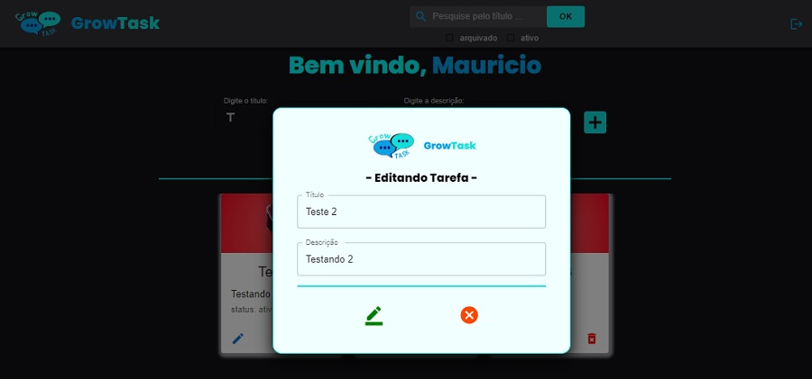

<h1 align="center">- GrowTask - </h1>
<h1  align="center"> Sistema de tarefas/recados - Consumindo API </h1>

 
Atividade realizada para o final do módulo <strong>Back-end</strong> do programa Starter da  <a href="https://www.growdev.com.br/">Growdev</a>. Este é o front-end para consumir a API.

&nbsp;&nbsp;&nbsp;|&nbsp;&nbsp;&nbsp;
  <a href="#-tecnologias">Tecnologias</a>&nbsp;&nbsp;&nbsp;|&nbsp;&nbsp;&nbsp;
  <a href="#-projeto">Projeto</a>&nbsp;&nbsp;&nbsp;|&nbsp;&nbsp;&nbsp;

 

## 💻 Telas do projeto:

 

  

  

  

  

  

  

  

  

 

## 🚀 Tecnologias

Esse projeto foi desenvolvido com as seguintes tecnologias:

- [Axios](https://axios-http.com/docs/intro)
- [ReactJS](https://create-react-app.dev/docs/getting-started/)
- [Typescript](https://www.typescriptlang.org/)
- [Redux](https://redux-toolkit.js.org/introduction/getting-started)
- [React Router Dom](https://reactrouter.com/en/v6.3.0/getting-started/installation)
- [Styled Components](https://styled-components.com/)
- [Material UI](https://mui.com/pt/material-ui/getting-started/overview/)
- [Node e NPM](https://nodejs.org/)

 

## 📚 Projeto

O Growtask é um projeto que foi desenvolvido para a atividade final do módulo "Front-end III" do programa Starter da Growdev.  E essa aplicação foi refatorada para utilização da API. Versão atualizada do projeto <a href="https://github.com/mauriciolima2701/growtask-reactjs"> growtask-reactjs. </a>
